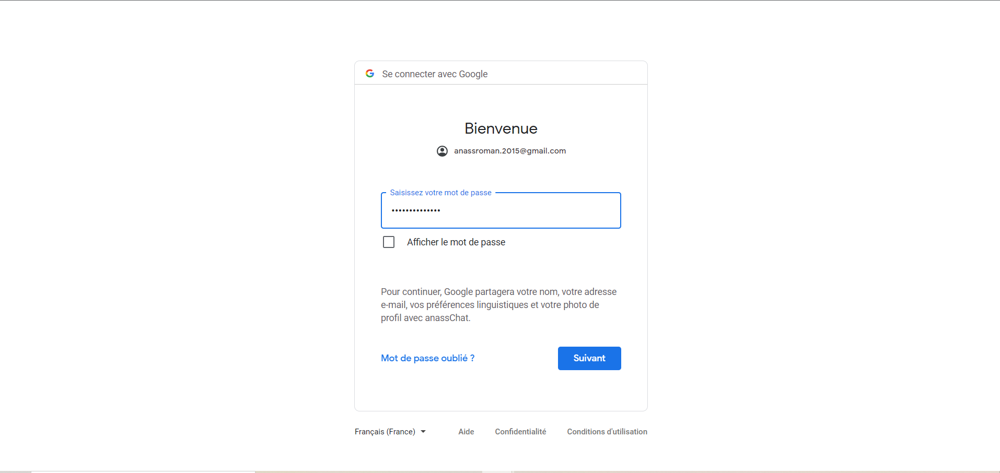

# nodeJS-Chat-App

## Intro/Objectif du projet
Une application Web de médias sociaux qui permet aux utilisateurs de se connecter/s'inscrire et d'effectuer des tâches telles que poster des photos, videos, et simplifie la communication en temps réel. L’application a été développé avec NODE JS et EXPRESS, EJS et MONGODB.

## Comment Démarrer le projet

``` bash

# install dependencies
npm install

# demarrer le projet
node app

```

## Captures d'écran du projet
---

### S'inscrire :
---------------
<p align="center">


#### S'inscrire avec Google


#### S'inscrire avec Facebook

</p>

***

### Se connecter :
---------------
<p align="center">


#### Se connecter avec Google



#### Se connecter avec Facebook

</p>

***

### Page d'accueil :
--------------------
<p align="center">


#### Pour partager une video


#### Pour partager une image


#### Pour gerer les parameters


</p>

***

### Gérer le profil :
--------------------
<p align="center">

#### changer la photo de profile


#### envoyer une invitation


#### recevoir l'invitation en temps réel 


#### accepter ou refuser l'invitation


#### refuser l'invitation


#### accepter l'invitation

</p>

***

### Les technologies
* Argon Social, [Télécharger](https://github.com/ArtMin96/argon-social).
* Node JS 
* MongoDB
* ExpressJS
* JavaScript 
* Bootstrap
* Html
* Css
* VSCode


